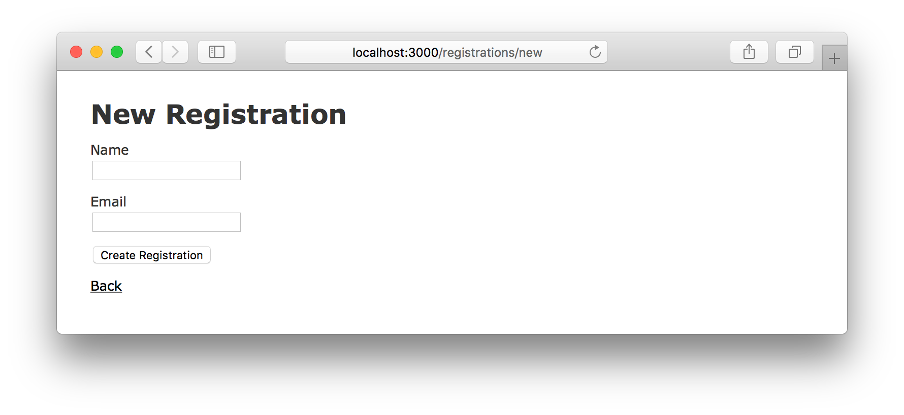
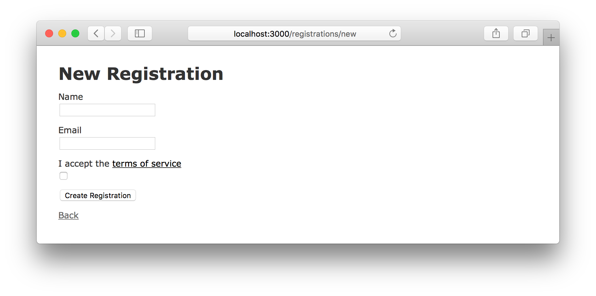
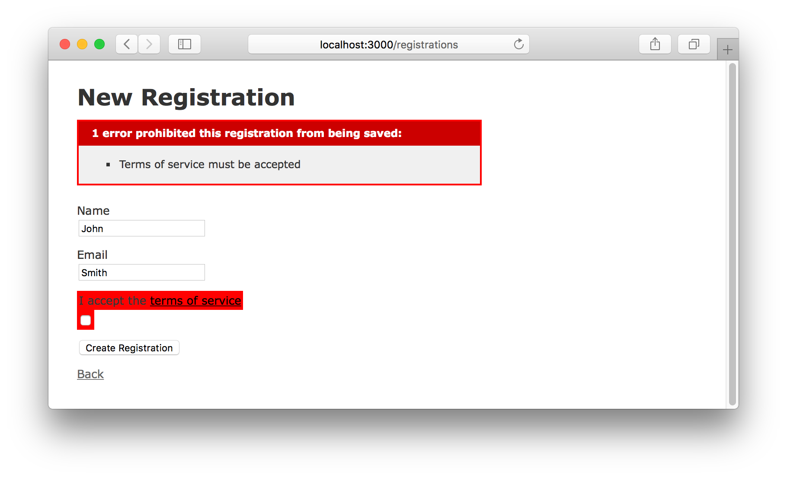
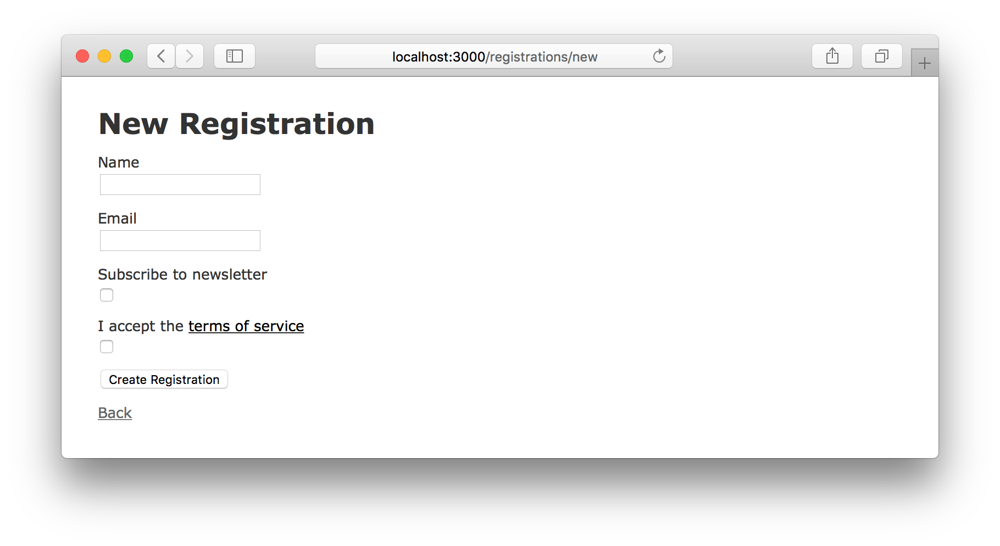

# User Consent Examples for Rails Apps

This repo demonstrates some approaches to various aspects of handling user consents in a Rails app.

It begins with with some basic cases then move onto more complex situations.

The code for each example is stored in its own directory.
Each example creates a separate database, which matches the directory name.

If you want to compare different examples, you can use `diff`, e.g.:

```
diff --recursive --exclude=tmp --exclude=log --exclude=config 00_consents_example_app 01_consents_example_app
```

## Setup

For each example, `cd` into its directory then run:

```
bin/setup
```

To start the app, run:

```
bin/rails s
```
You can then access the registration form at
[http://localhost:3000/registrations/new](http://localhost:3000/registrations/new) 

## 00 Baseline

As a baseline, we begin with an app with no consents.



This was generated by running:

`bin/rails generate registration name:string email:string`

The only addition was validations on the `name` and `email` fields:
[app/models/registration.rb](00_consents_example_app/app/models/registration.rb#L2-L4)

## 01 Implied Consent

The simplest thing we can build is an implied consent:


We only want this to be shown when the user is registering, so we hide it when editing an existing registration:

[app/views/registrations/_form.html.erb](01_consents_example_app/app/views/registrations/_form.html.erb#L24-L28)

The main problem with this approach is that is probably isn't legally valid.

With new legislation such as the GDPR, users must explicitly opt-in by performing an action.

## 02 Checkbox



First we add the checkbox to the form.

[app/views/registrations/_form.html.erb](02_consents_example_app/app/views/registrations/_form.html.erb#L25-L28)

Next we need to verify that the user checks the checkbox.
We'll make use of Rails built-in `acceptance` validator:

[app/models/registration.rb](02_consents_example_app/app/models/registration.rb#L4)

We also need to update the controller to allow this new parameter to be passed to the model:

[app/controllers/registrations_controller.rb](02_consents_example_app/app/controllers/registrations_controller.rb#L72)

If the user doesn't accept the terms, they can't register:


Note that we are not persisting the consent to the database, but since this consent is mandatory, we can assume that anyone who has registered has accepted the terms.

## 03 Checkbox with boolean DB field

There may be circumstances where we want to store the consent in the database.

Let's add a migration for the new field:

[db/migrate/20190717233640_add_terms_of_service_to_registrations.rb](03_consents_example_app/db/migrate/20190717233640_add_terms_of_service_to_registrations.rb)

(For data integrity, we prevent nulls being accidentally written to the field).

Perhaps surprisingly, this is the only change we need. The checkbox value is automatically persisted to the database.

## 04 Checkbox with timestamp DB field

It's often useful to record a timestamp for when a consent was agreed to.

Instead of a boolean, let's add a `datetime` field:

[db/migrate/20190718004138_add_terms_of_service_to_registrations.rb](04_consents_example_app/db/migrate/20190718004138_add_terms_of_service_accepted_at_to_registrations.rb)

We next have to add behaviour to set the timestamp if the checkbox is checked.
So where should this code live?

I don't recommend this approach, but one option is in the controller:

```ruby
def create
  @registration = Registration.new(registration_params)

  if registration_params["terms_of_service"] == "1"
    @registration.terms_of_service_accepted_at = Time.now
  end

  if @registration.save
    redirect_to @registration, notice: 'Registration was successfully created.'
  else
    render :new
  end
end
```

But ideally we should kept controller simple and with minimal logic.

The other approach is to add 'getter' and 'setter' methods to override the ones
automatically generated by ActiveRecord:

[app/models/registration.rb](04_consents_example_app/app/models/registration.rb#L6-L14)

Note we have to treat `value` as a string, not a boolean.

This allows for a clean separation of concerns between the controller and model.

# 05 Optional Consents

Let's add a second field to the form for an email newsletter. The user will be
able to later opt-in or opt-out of the newsletter.



First we need a migration to add the new field.
Unlike the Terms of Service checkbox, this will an optional consent, so we will allow `null` values.

[db/migrate/20190718010749_add_subscribe_to_newsletter_to_registrations.rb](05_consents_example_app/db/migrate/20190718010749_add_subscribe_to_newsletter_to_registrations.rb)

We'll also update the controller to allow the new checkbox value to be passed to the model.

[app/controllers/registrations_controller.rb](05_consents_example_app/app/controllers/registrations_controller.rb#L72)

Again we'll record the timestamp the consent was accepted, but we also need to
clear the field if the user choose to unsubscribe:

[app/models/registration.rb](05_consents_example_app/app/models/registration.rb#L10-L11)

We could do this by simply adding an else branch, but I prefer to make it
explicitly check for the value of `"0"` to ensure the checkbox value is actually
being passed to the model. If the value is neither `"0"` or `"1"` then
we raise an error.

# 06 Storing Consents in a separate table

In a large app with many kinds of complexities, it may be helpful to store the
consents in a different table.

We'll introduce a new model named `Consent`.

Whenever a new registration is created, a corresponding `Consent` record should
be created.

I've chosen add a `registration` association  the `Consent` model. Another
approach could have been to add a `consent` association the `Registration`
model.

Let's start with the migration:

[db/migrate/20190718021535_create_consents.rb](06_consents_example_app/db/migrate/20190718021535_create_consents.rb)

And next, the Consent model:

[app/models/consent.rb](06_consents_example_app/app/models/consent.rb)

To keep things simple for this example, we'll use the same consent record to store both consents.

The getters and setters that were in `Registration` in the previous example are
now in the `Consent` model.

In the `Registration` model, we declare a `has_one` relationship. We also enable
`autosave` so that we don't have to save changes to the consent separately.

Let's now consider the controller. It shouldn't need to know we have have
separate models for `Registration` and `Consent`. We can transparently
delegate the appropriate methods to the `Consent` instance.

[app/models/registration.rb](06_consents_example_app/app/models/registration.rb#L8-L12)

This is sufficient for editing an existing registration. But for creating a new
registration, we need one more step. We need to build a new consent when one
doesn't already exist. The code for this may look a little strange:

[app/models/consent.rb](06_consents_example_app/app/models/consent.rb#L14-L16)

When we call `super`, we're calling the `consent` defined in the `has_one`
association. If no record exists, it returns `nil`, so we then call
`build_consent`.
